YawsPi - Yet Another Watering System for raspberry PI
===================================================

General description
-------------------

System developed for automatic watering of plants.

Why not use automatic timed water dispensers?
-------------------

Every plant needs different rate of watering and soil humidity, e.g. Cyperus needs a lot of water,
the swamp is ideal. Contrary Zamioculcas likes small amount of water in shady places, and dry soil.
Simple drop waterer or water dispenser can not do this. One can solve some problems by self watering
pots, but they have mostly limited water volume.

Why not one of similar projects?
-------------------

Similar projects (other exists):
[Parrot Flower Power](http://www.parrot.com/usa/products/flower-power/),
[Edyn](https://www.edyn.com/),
[OpenSprinkler](http://rayshobby.net/opensprinkler/).

These projects are either expensive (the project was aimed in the beginning for 14 power pots, every
one with different plant), or not suitable to my needs. Probably there exists at least one suitable
and cheap enough project in the world, but I couldn't find it in 2013 and it was fun to develop it.
And... it is not finished, never will be, so I have something to do till my end of life.

Price budget
-------------------

* Raspberry Pi: ~37 euro
* Valves: 14\*5.5 = 78 euro
* Pump: 17 euro
* Power source: ~33 euro
* PCBs: ~75 euro
* Sensors etc: ~75 euro
* Total: something about 315 euro

Compare this to the OpenSprinkler (145 euro for DIY version and zone expander), which can not water
pot by soil humidity. Anyway I owe a lot of inspiration and learned code to the OpenSprinkler and
OpenSprinklerPi.

Short description
-------------------

The watering system is built in such way that: there is one water source (e.g. barrel of water, or
water tap). A pump is used to pump water from water source. Water is leaded by tubes into several
valves. From valves water is leaded to the plant pots. Control software always open only one valve,
so only one water pump is required and software can direct water from water source to the desired
plant pots. Every plant pot and water source can have one water level sensor.

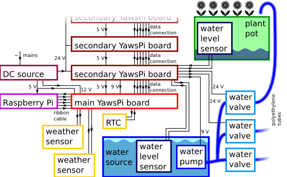

System can be set to water plants in plant pots in three different ways:

1. watering based on water level or soil humidity of the plant pot,
2. watering based on the day of the week and hour of the day and on the water level or soil humidity of the pot,
3. watering every Nth day and hour and on the water level or soil humidity of the pot.

The system logs watering and weather, so hopefully I will be able to relate temperature/humidity to
the water consumption of particular plants. The plan is also to increase or decrease frequency of
watering depending on the temperature/humidity/rain.

System consists of:

1. Hardware with components:
  1. controlling computer Raspberry Pi,
  2. power supply,
  3. water pump,
  4. water valves,
  5. water level sensors (optional),
  6. weather sensors (optional),
  7. water tubes.
  8. YawsPi electronics,
2. Software with components:
  1. Hardware modules,
  2. hardware configuration,
  3. hardware abstraction layer,
  4. main program running in two threads, one is for watering, second one is for web server.

Detailed description of hardware
-------------------

### Raspberry Pi ###

System was built up on Raspberry Pi, but any other with general purpose input/output ports and able to run python can be used.

### Power supply ###

Raspberry Pi requires 5 V, water pump requires 6-9 V, water valves requires 24 V. Switching power
supply Mean Well RQ-85D was selected. It has got one 5 V, 6 A output, one 12 V 2 A output, one 24 V 1 A
output and one -12 V 0.5 A output.
[Datasheet](./datasheets/power_source_Mean_Well_RQ-85D.pdf).

You can buy one in shops with electronics, like <http://www.gme.cz> or <http://www.farnell.com>.

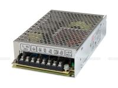

### Water pump ###

Immersible Barwig BW04 water pump was used. It can pump up to 10 l/min. For continuous usage needs 
6 to 9 V power source. It was immersed directly into the barrel - water source.
[Datasheet](./datasheets/water_pump_Barwig_BW04.pdf).

You can buy it e.g. at <http://www.conrad.cz>.

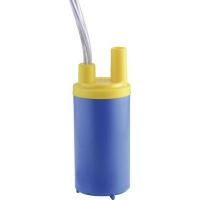

### Water valves ###

The cheapest water valve I was able to find was VIVA Sanela VE-RPE4115NC. It is monostable DC coil
powered by 24 V, normally closed, i.e. without any power it is closed. That was the safety
requirement - if the power goes wrong, water is stopped. It is used in water plumbing, so you can
buy such valve in several shops, like: <http://www.sanela.cz/>.

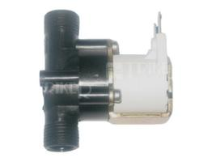

### Water level sensors ###

Water level sensors are two types: binary or gradual.

#### Binary (1/0) water level sensors ####

I used these two:

Hamlin sensor (or copies from <http://dx.com/>), which is based on floating magnet, and changes resistance
from less than 1 Ohm to more than 10^9 Ohm. It is attached vertically and is good for pots.
[Datasheet](./datasheets/Hamlin_Float_Sensor_59630-2-T-02-A.pdf)

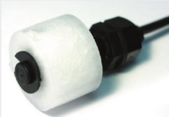

Gentech sensor (or copies from <http://dx.com/>), which is based on floating magnet similarly as
previous sensor. It is attached horizontally and is good for barrel of water source.
[Datasheet](./datasheets/gentech_FLCS-01_Float_Switch.pdf)

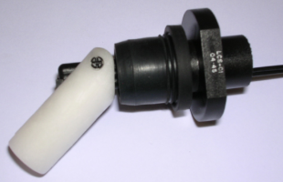

Both sensors are just connected to digital input of a port expander.

#### Gradual water level sensors ####

I am still testing gradual sensors, mainly this one for soil humidity:
<http://www.dx.com/p/freaduino-soil-humidity-sensor-for-arduino-white-147817>

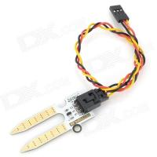

and this one for water level:
<http://www.dx.com/p/062301-water-sensor-working-with-official-arduino-products-red-228292>.

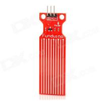

Problem of such sensors is durability. Water or humid soil is corrosive. When switched on, it
corodes even more. The first one is good because it is gold plated. It gives output of 0 V to 5 V in
dry to humid soil (when powered by 5 V). The second one is much cheaper, it can sustain long time in water, but degrades
quickly when powered. It gives output of 0 V to 5 V according water level. Corrosion is the reason
why the power to gradual sensor is switched on only during measurement.

### weather sensors ###

Following weather sensors are implemented:

1. Air temperature
2. Air humidity
3. Air pressure
4. Ambient illuminance
5. Rain status

#### air temperature ####

The ambient temperature can be measured either by DHT11 sensor (used for air humidity) or BMP180
sensor (used for air pressure).

#### air humidity ####

The humidity is measured by DHT11 sensor, I used terrible but cheap module from Keyes. I had to remove
the original capacitor from module and original resistor replace by a 9.9 kOhm resistor. 
[Datasheet](./datasheets/humidity_sensor_Keyes_DHT11.pdf).

I bought it here:
<http://www.dx.com/p/keyes-dht11-fr4-temperature-humidity-sensor-module-for-arduino-red-blue-300280>

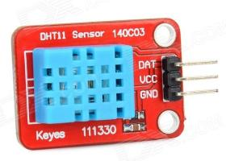

#### air pressure ####

The pressure is measured by BMP180 sensor.
[BMP 180 Datasheet](./datasheets/BST-BMP180-DS000-08.pdf).

I bought this module:
<http://www.dx.com/p/bmp180-bosch-temperature-air-pressure-module-deep-blue-294251>

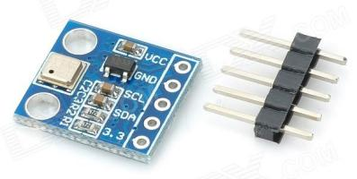

#### ambient illuminance ####

The light intensity is measured by BH1750FVI sensor.
[BH1750FVI Datasheet](./datasheets/bh1750fvi-e.pdf).

I bought this module:
<http://www.dx.com/p/bh1750fvi-digital-light-intensity-sensor-module-blue-182595>

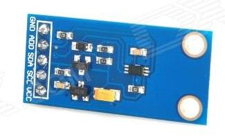

#### rain status ####

The rain status is measured by module from Octopuss. Essentially it is grad type water level sensor. I bought it here:
<http://www.dx.com/p/octopus-rain-steam-sensor-module-w-cable-white-silver-192829>

It is connected to AD converter.

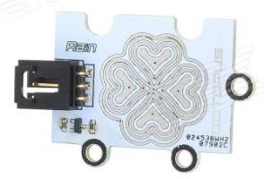

### water tubes ###

I bought polyethylene tubes, joints etc. to connect pump, valves and pots here: 
<http://www.instarjbc.cz>
and here:
<http://www.koupelnyeshop.cz/>
.

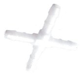

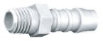
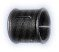

Valve with connections for polyethylene tube:

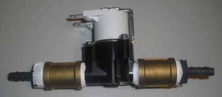

### RTC ###

Real time clock module keeps time in the case of boot up without internet. It is based on the chip PCF8563.
[Module Datasheet](./datasheets/PCF8563_SCH.pdf),
[PCF8563 Datasheet](./datasheets/PCF8563.pdf).

I bought it here: 
<http://www.dx.com/p/pcf8563-rtc-board-for-raspberry-pi-real-time-clock-module-blue-281614>

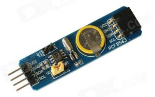

### YawsPi electronics ###

This is electronics to interface power source, water pump, water level and weather sensors to the
Raspberry Pi. Generally it transform voltage levels and connects sensors, analogue to digital
converters and port expander to the Raspberry Pi.

#### Main board ####

Main board contains connector to Raspberry Pi, connectors for weather sensors (all but rain sensor),
RTC, voltage stabilizer to generate water pump voltage, bidirectional voltage converter and
unidirectional voltage converter. Raspberry Pi works with 3.3 V logic level. To convert logic to 5 V,
bidirectional level converter JY-MCU is used for I2C bus. It can convert only four wires,
therefore it is used only for wires where bidirectionality is required. For the rest a
unidirectional voltage converter with 74LVC8T245 chip was used.

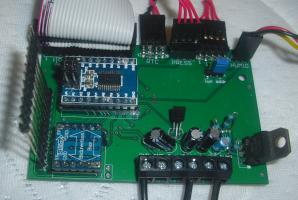

#### Secondary board ####

The secondary board contains two port expanders MCP23017, one AD converters MCP3008 for mesurement
of grad sensors value, two transistor arrays ULN2003A and one relay. One transistor array is connected to 24 V and one port expander. It is used to
switch valves. Second transistor array is connected to 5 V and second port expander. It is used to switch grad sensors (why it is needed see grad
sensors hardware). Rest of pins of port expanders are used for binary water level sensors. AD
converter is used to read value of gradual water level sensors. A relay is used to switch water
pump.

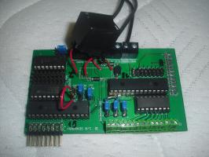

Multiple secondary boards can be (theoretically, not tested) connected and stacked. One have to
ensure all I2C addresses of port expanders and sensors and SPI cable select wires are different on
all boards.

#### Bidirectional level converter ####
I used JY-MCU 5V 3V IIC UART SPI Level 4-Way Converter Module Adapter from 
<http://www.dx.com/p/74lvc8t245-8-ch-ttl-coms-level-conversion-module-deep-blue-286606>.
It is based on 4 MOSFETs. A lot of other similar boards can be found.

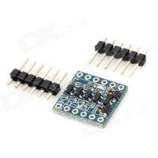

#### Unidirectional level converter ####
I used 74LVC8T245 8-CH TTL COMS Level Conversion Module from <http://www.dx.com/p/74lvc8t245-8-ch-ttl-coms-level-conversion-module-deep-blue-286606>.
It is based on chip 74LVC8T245. Level conversion direction is set by a jumper.

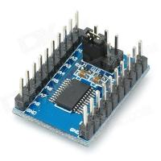

#### Port Expander ####
MCP23017 has 16 I/O ports and is controlled by I2C bus.
[Datasheet](./datasheets/MCP23017.pdf).

#### ADC ####
MCP3008 is 10-bit 8 channel AD converter and is controlled by SPI bus.
[Datasheet](./datasheets/MCP3008.pdf).

#### Transistor array ####
ULN2003A has 7 darlington transistors. It is controlled directly by TTL signal. It is used for
binary water level sensors and power to the gradual sensors. (It would be probably better to use TD62783
chip, maybe in next revision...)
[Datasheet](./datasheets/uln2003a.pdf).

Detailed description of software
-------------------

Software is documented by doxygen. It is running in two threads. Main thread does watering, timing,
data saving and loading etc. Second thread serve as a web server, and can set flags for first
thread. Main thread reacts to these flags when possible (not immediately).

Main thread runs in loops, time length of the loop can be set by user (e.g. one hour). At the
beginning of the loop software first measures water levels and values of other sensors. Next it
determines if watering of some pot should start. If so, it waters pots. Than it waits for next
iteration of the loop.

Software can be controlled by the user by means of a web page. 

### watering programs ###

Watering is driven by programs. Three types of programs are used:

1. Water level mode of operation.
2. Weekly mode of operation.
3. Interval mode of operation.

First one waters only if station is empty at least for specified amount of time, and not sooner than
specified amount of time from last watering. Usefull when watering should be driven by water level
with some binary water level sensors or by soil humidity, if gradual water level sensor is assigned.

Second type of program waters only at specified days of week, and every specified amount of time
during the day. Usefull for watering lawns every weekend. If water level sensor is assigned, the
watering runs only if water level is measured as zero (empty).

Third type of program is the same as second, but the day is specified by interval of days. I.e. if
interval is 2 days, every second day watering will start. It means at first week it will be on
Monday, Wednesday, Friday, Sunday, then second week on Tuesday, Thursday, Sunday and third week
again Monday etc.

For every program valid time during day can be specified. The program will commence only in
specified time of day.

To every program one or more stations must be assigned.

Program can be switched on or off.

Any number of programs can be created.

### main part of software ###

Main part of software is in yawspi.py. After startup the run is divided into two threads. To test
the system, run following on a PC (not in Raspberry Pi) in yawspisw directory:

        python yawspi.py

Now the system will run in demo mode with demo hardware configuration. Take a look at webpage on
address <http://127.0.0.1:8080>, you should see a home page.

#### home webpage ###

Home page shows basic status of the hardware, we separate the sets of brackets:

This is [an example] [id] reference-style link.

Then, anywhere in the document, you define your link label like this, on a line by itself:ather sensors, water level sensors and programs.

Button refresh page just reloads this page. Button Check now asks the main thread to break waiting
loop and to measure water levels now and commence any watering if needed.

Buttons at the bottom of the page leads to other webpages.

#### options webpage ###

Several settings related to general system can be setup on this webpage.

#### stations webpage ###

A list of stations is here. By pressing button Water now this station will be filled by water
independently on the watering program. Settings can by changed by pressing button Edit. Number of
stations is determined by hardware settings.

#### programs webpage ###

New programs can be added here or settings of existing programs can be edited. By pressing button
Check programs, a list of watering times of active watering programs for next days is shown.
Watering programs with water level mode of operation are ommited, because they are not driven
primarily by date and time.

#### log webpage ###

Log of the system is shown from newest to oldest. Usefull for determining problems.

#### history webpage ###

A chart of history of stations or weather sensors can be shown. Data are shown only if saving of
particular data is switched in options webpage.

### hardware abstraction layer ###

The hw_control.py module serve as abstraction layer.

### hardware modules ###

Python modules for hardware were copied from <http://www.adafruit.com/>, from <http://www.astromik.org/malymenu/menuraspi.htm> or written by myself.
List of modules:

* Adafruit_I2C.py
* Adafruit_MCP230XX.py
* BH1750.py
* BMP180.py
* DHT11.py
* MCP3008.py
* rtc8563.py

### hardware configuration ###

Configuration of the hardware is written in hw_config.py. If the software is not run on raspberry,
hw_config_demo.py is used. Because theoretically more secondary boards can be connected, there is
used a simple syntax for pin numbering. Every pin is composed of tuple of two numbers. First number
determines device - GPIO of Rapsberry Pi is 0, first port expander is 1, second is 2 etc. First AD
converter is -1, second is -2 etc. Second number is a pin on the device itself. For example, fifth
IO pin on second port expander is written as (2, 4), because pins are numbered from zero in python
modules and datasheets. To help find out where is what connected, following figure can be used.

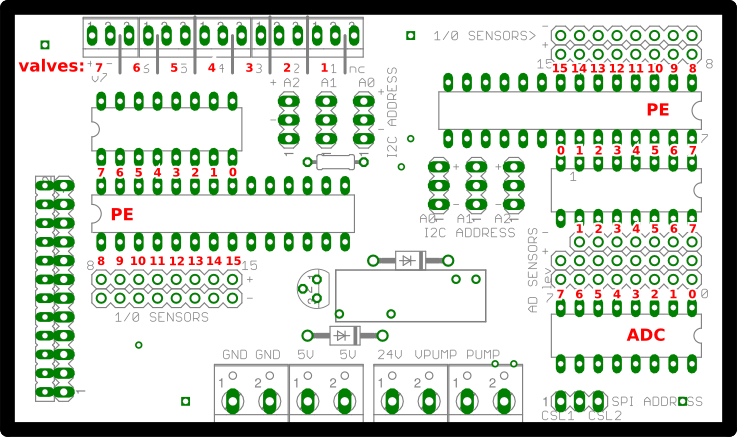

In the configuration is written complete setup of the hardware. Please see hw_config_demo.py for
explained and fully described example.

For every water station (pot) there is dedicated one valve and one software water level sensor
(which can be composed of several hardware water level sensors).

#### software representation of water level sensors ####
Hardware water level sensors are represented in the software as one of these types:

1. none
2. min
3. max
4. minmax
5. grad

This software representations can take data from zero, one or two hardware water level sensors.
Other types can be implemented by modifying hardware abstraction layer. Final output of every sensor
is between 0 (empty) to 1 (full). User can setup low and high thresholds. For example if output of
sensor is below low threshold, output is considered as zero. This is to prevent measurement noise.

#### none ####

No water level sensor. Software always assume the water pot is always empty. Amount of water needed to
water the pot is determined by the water capacity of the water pot.

#### min ####

Sensor changes state when water level reaches the bottom of the water pot. Sensor detects water pot
is empty, otherwise software assume water pot is 50% full. Amount of water needed to water the pot
is determined by the water capacity of the water pot. For this one binary water level sensor placed
at the bottom of pot is needed.

#### max ####

Sensor changes state when water level reaches the top of the water pot. Sensor detects water pot is
full, otherwise software assume water pot is 50% full. Amount of water needed to water the pot is
determined by the sensor. For this one binary water level sensor placed at the top of pot is needed.

#### minmax ####

Sensor changes state when water level reaches the top or the bottom of the water pot. Sensor detects
water pot is full, empty or 50%. Amount of water needed to water the pot is determined by the
sensor. For this two binary sensors are needed, one placed at the bottom, second at the top of the
pot.

#### grad ####
Analog sensor. Sensor directly detects the water level. Amount of water needed to water the pot is
determined by the sensor. For this one gradual water sensor is needed.

