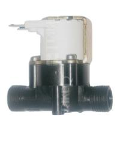

YawsPi - Yet Another Watering System for raspberry PI
===================================================

General description
-------------------

System developed for automatic watering of plants.

Why not use automatic timed water dispensers?
-------------------

Every plant needs different rate of watering and soil humidity, e.g. Cyperus needs a lot of water,
the swamp is ideal. Contrary Zamioculcas likes small amount of water in shady places, and dry soil.
Simple drop waterer or water dispenser can not do this. One can solve some problems by self watering
pots, but they have mostly limited water volume.

Why not one of similar projects?
-------------------

Similar projects (other exists):
[Parrot Flower Power](http://www.parrot.com/usa/products/flower-power/),
[Edyn](https://www.edyn.com/),
[OpenSprinkler](http://rayshobby.net/opensprinkler/).

These projects are either expensive (the project was aimed in the beginning for 14 power pots, every
one with different plant), or not suitable to my needs. Probably there exists at least one suitable
and cheap enough project in the world, but I couldn't find it in 2013 and it was fun to develop it.
And... it is not finished, never will be, so I have something to do till my end of life.

Price budget
-------------------

* Raspberry Pi: ~37 euro
* Valves: 14\*5.5 = 78 euro
* Pump: 17 euro
* Power source: ~33 euro
* PCBs: ~75 euro
* Sensors etc: ~75 euro
* Total: something about 315 euro

Compare this to the OpenSprinkler (145 euro for DIY version and zone expander), which can not water
pot by soil humidity. Anyway I owe a lot of inspiration and learned code to the OpenSprinkler and
OpenSprinklerPi.

System description
-------------------

The watering system is built in such way that: there is one water source (e.g. barrel of water, or
water tap). A pump is used to pump water from water source. Water is leaded by tubes into several
valves. From valves water is leaded to the plant pots. Control software always open only one valve,
so only one water pump is required and software can direct water from water source to the desired
plant pots. Every plant pot and water source can have one water level sensor.

System can be set to water plants in plant pots in three different ways:
1, watering based on water level or soil humidity of the plant pot,
2, watering based on the day of the week and hour of the day and on the water level or soil humidity of the pot,
3, watering every Nth day and hour and on the water level or soil humidity of the pot.

The system logs watering and weather, so hopefully I will be able to relate temperature/humidity to
the water consumption of particular plants. The plan is also to increase or decrease frequency of
watering depending on the temperature/humidity/rain.

System consists of:

1. Hardware with components:
  1. controlling computer Raspberry Pi,
  2. power supply,
  3. water pump,
  4. water valves,
  5. water level sensors (optional),
  6. weather sensors (optional),
  7. water tubes.
  8. YawsPi electronics,
2. Software with components:
  1. Hardware modules,
  2. hardware configuration,
  3. hardware abstraction layer,
  4. main program running in two threads, one is for watering, second one is for web server.

Detailed description of hardware
-------------------

### Raspberry Pi ###

System was built up on Raspberry Pi, but any other with general purpose input/output ports and able to run python can be used.

### Power supply ###

Raspberry Pi requires 5 V, water pump requires 6-9 V, water valves requires 24 V. Switching power
supply Mean Well RQ-85D was selected. It has got one 5 V, 6 A output, one 12 V 2 A output, one 24 V 1 A
output and one -12 V 0.5 A output.
[Datasheet](./datasheets/power_source_Mean_Well_RQ-85D.pdf).

You can buy one in shops with electronics, like <http://www.gme.cz> or <http://www.farnell.com>.

### Water pump ###

Immersible Barwig BW04 water pump was used. It can pump up to 10 l/min. For continuous usage needs 
6 to 9 V power source. It was immersed directly into the barrel - water source.
[Datasheet](./datasheets/water_pump_Barwig_BW04.pdf).

You can buy it e.g. at <http://www.conrad.cz>.

### Water valves ###

The cheapest water valve I was able to find was VIVA Sanela VE-RPE4115NC. It is monostable DC coil
powered by 24 V, normally closed, i.e. without any power it is closed. That was the safety
requirement - if the power goes wrong, water is stopped. It is used in water plumbing, so you can
buy such valve in several shops, like: <http://www.sanela.cz/>.

### water level sensors ###

XXX popis sensoru do softwaru XXX
For now I have implemented following water level sensors:

1. none
2. min
3. max
4. minmax
5. grad

For min, max and minmax sensors I used these two:
XXX
For grad sensor I tested:
XXX

#### none ####

No water level sensor. Software always detects the water pot is empty. Amount of water needed to
water the pot is determined by the water capacity of the water pot.

#### min ####

Sensor changes state when water level reaches the bottom of the water pot. Sensor detects water pot
is empty. Amount of water needed to water the pot is determined by the water capacity of the water
pot.

#### max ####

Sensor changes state when water level reaches the top of the water pot. Sensor detects water pot is
full. Amount of water needed to water the pot is determined by the sensor.

#### minmax ####

Sensor changes state when water level reaches the top or the bottom of the water pot. Sensor detects
water pot is full, empty or in between. Amount of water needed to water the pot is determined by the
sensor.

#### grad ####
Analog sensor. Sensor directly detects the water level. Amount of water needed to water the pot is
determined by the sensor.

### weather sensors ###

Following weather sensors are implemented:

1. Air temperature
2. Air humidity
3. Air pressure
4. Ambient illuminance
5. Rain status

#### air temperature ####

The ambient temperature can be measured either by DHT11 sensor (used for air humidity) or BMP180
sensor (used for air pressure).

#### air humidity ####

The humidity is measured by DHT11 sensor, I used terrible but cheap module from Keyes. I had to remove
the original capacitor from module and original resistor replace by a 9.9 kOhm resistor. 
[Datasheet](./datasheets/humidity_sensor_Keyes_DHT11.pdf).

I bought it here:
<http://www.dx.com/p/keyes-dht11-fr4-temperature-humidity-sensor-module-for-arduino-red-blue-300280>

#### air pressure ####

The pressure is measured by BMP180 sensor.
[BMP 180 Datasheet](./datasheets/BST-BMP180-DS000-08.pdf).

I bought this module:
<http://www.dx.com/p/bmp180-bosch-temperature-air-pressure-module-deep-blue-294251>

#### ambient illuminance ####

The light intensity is measured by BH1750FVI sensor.
[BH1750FVI Datasheet](./datasheets/bh1750fvi-e.pdf).

I bought this module:
<http://www.dx.com/p/bh1750fvi-digital-light-intensity-sensor-module-blue-182595>

#### rain status ####

The rain status is measured by module from Octopuss. Essentially it is grad type water level sensor. I bought it here:
<http://www.dx.com/p/octopus-rain-steam-sensor-module-w-cable-white-silver-192829>

It is connected to AD converter.

### water tubes ###

I bought polyethylene tubes, joints etc. to connect pump, valves and pots here: 
<http://www.instarjbc.cz>
and here:
<http://www.koupelnyeshop.cz/>
.

Valve with connections for polyethylene tube:

### RTC ###

Real time clock module keeps time in the case of boot up without internet. It is based on the chip PCF8563.
[Module Datasheet](./datasheets/PCF8563_SCH.pdf),
[PCF8563 Datasheet](./datasheets/PCF8563.pdf).

I bought it here: 
<http://www.dx.com/p/pcf8563-rtc-board-for-raspberry-pi-real-time-clock-module-blue-281614>

### YawsPi electronics ###

This is electronics to interface power source, water pump, water level and weather sensors to the
Raspberry Pi. Generally it transform voltage levels and connects sensors, analogue to digital
converters and port expander to the Raspberry Pi.

Main board contains connector to Raspberry Pi, connectors for weather sensors (all but rain sensor),
RTC, voltage stabilizer to generate water pump voltage, bidirectional voltage converter and one way
voltage converter. Raspberry Pi works with 3.3 V logic level. To convert logic to 5 V, bidirectional
level converter XXX is used for I2C bus. It can convert only four wires, therefore for the rest a
voltage converter with 74LVC8T245 chip was used.

The secondary board contains two port expanders MCP23017, one AD converters MCP3008 for mesurement
of grad sensors value, and two transistor arrays ULN2003A. One array is connected to 24 V and
switches valves. Second one is connected to 5 V and switches grad sensors (why it is needed see grad
sensors hardware). Secondary board also contain a relay to switch water pump. It electrically
isolated by relay because the water pump is always immersed in water.

Multiple secondary boards can be connected. One have to ensure all I2C addresses of port expanders
and sensors and SPI cable select wires are different on all boards.

#### Bidirectional level converter ####
XXX
#### one way level converter ####
XXX
#### Port Expander ####
MCP23017 has 16 I/O ports and is controlled by I2C bus.
[Datasheet](./datasheets/MCP23017.pdf).

#### ADC ####
MCP3008 is 10-bit 8 channel AD converter and is controlled by SPI bus.
[Datasheet](./datasheets/MCP3008.pdf).

#### Transistor array ####
ULN2003A has 7 darlington transistors. It is controlled directly by TTL signal. It is used for
switching water valves and power to the grad sensors. (It would be probably better to use TD62783
chip, maybe in next revision...)
[Datasheet](./datasheets/uln2003a.pdf).

Detailed description of software
-------------------

### hardware modules ###
### hardware configuration ###
### hardware abstraction layer ###
### main program ###
